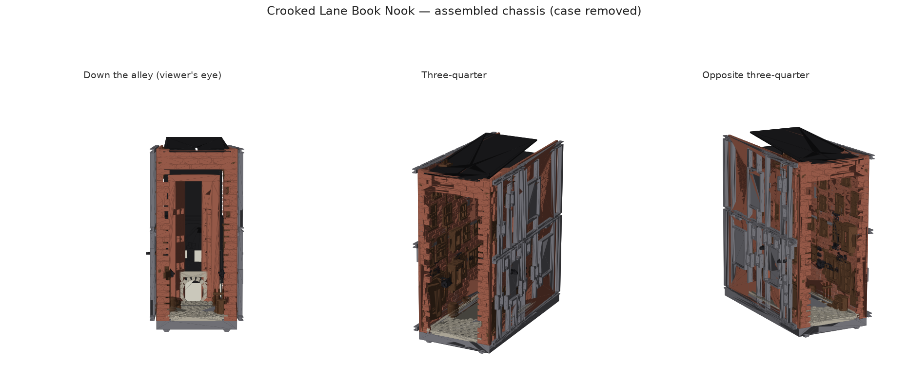
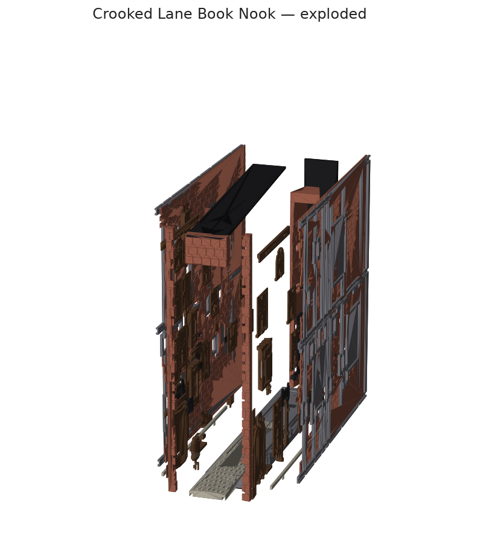

# Crooked Lane Book Nook

A parametric, fully-modular miniature book nook: a narrow crooked wizarding shopping
lane, 100 × 240 × 200 mm, engineered as a real model kit rather than a single print.

* **218 separately printable, separately paintable parts** — every window frame, sill,
  glazing pane, door, sign, bracket, lantern, pipe and barrel is its own part.
* **Snap-fit throughout** — four keyed connector types, no glue needed.
* **Cartridge architecture** — the whole lit interior is a self-supporting chassis you
  finish and test on the bench, then slide into the case from the rear.
* **Built for fairy lights** — pass-through bead pockets on two continuous string
  routes, plus a 59.5 mm RGB/CCT puck as an adjustable sky.
* **Nothing needs splitting** on a 256 mm bed (Bambu P2S).





## To print, you do not need to run anything

The STLs are committed. Clone or download the repo, open `out/plates/` and slice.
Start with `00_CALIBRATE_FIRST.stl`.

## To change it, five scripts

You only need Python and CadQuery if you want to alter the model — most likely to set
`FIT_CLEARANCE` after the calibration print, then re-export.

```bash
pip install cadquery

python3 params.py        # print the derived dimensions; changes nothing
python3 build.py         # every part -> out/stl, plus assembly and exploded previews
python3 build.py --list  # just list the 218 part IDs
python3 verify.py        # fit, keying, grip, envelope and manifest checks
python3 plates.py        # arrange the parts onto print plates -> out/plates
python3 render.py        # the preview images above
python3 render_coupon.py # a raked view of the tolerance coupon
```

**Everything under `lib/`, `parts/` and `data/` is import-only** — library modules the
scripts above pull from. Running one directly does nothing.

Outputs: `out/stl/*.stl`, `out/preview/assembly.step`, `out/preview/exploded.step`,
`out/manifest.json`.

## Change it

Everything lives in `params.py`. The three numbers most worth touching:

```python
FIT_CLEARANCE        = 0.25   # structural joints, per side
DECORATIVE_CLEARANCE = 0.20   # snap-in decoration, per side
PERSP_STRENGTH       = 0.42   # how hard the forced perspective is pushed
```

Adding a window is a row in `data/facade.py`, not a new function. The wall, its
sockets, its bead pocket and its parts are all derived from that row.

```
params.py           every dimension
lib/    mount.py    the four connector types; read the convention note at the top
        brick.py    brick relief with perspective scaling and a torn edge
        cobble.py   irregular cobbles that follow the road camber
        window.py   window / door / shopfront families
        sign.py     sign plates, brackets, chain
        prop.py     barrels, crates, cauldrons, lanterns
        light.py    bead pockets, channels, coil bays, baffles, puck cradle
data/   facade.py   the shop layout tables -- the file to edit
parts/  decor.py    turns a table row into parts + the cuts its wall needs
        walls.py    wall faces and service ribs
        structure.py chassis, floor, rear perspective assembly
        case.py     outer case, plinth, drawer, switch module
        kit.py      signs, props, lighting hardware, jigs
docs/   01_DESIGN_PLAN.md   the engineering rationale
        02_ASSEMBLY.md      print plan, wiring, paint guide
```

## Print the tolerance coupon first

`70A_Tolerance_Test_Coupon` carries P1 and P2 sockets at four clearances with the value
engraved beside each. Pick the fit that feels right, set it in `params.py`, re-export.
Every other part depends on that one number.
