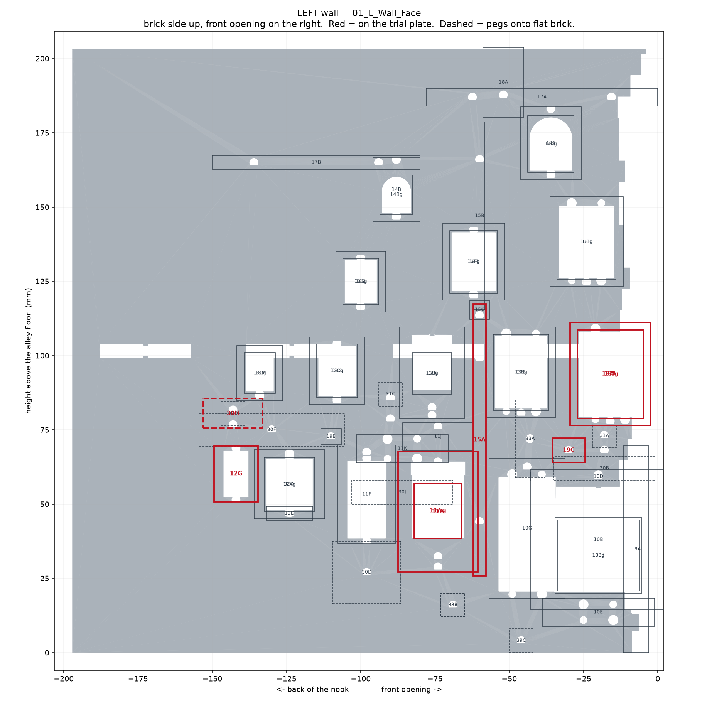
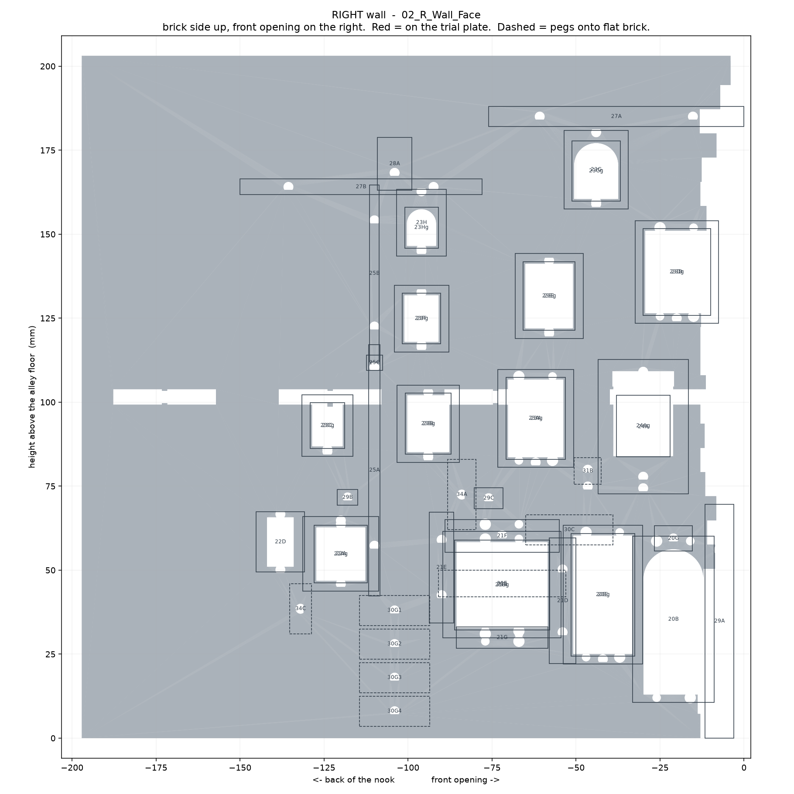

# 06 -- Where each part goes

Generated by `wallmap.py`. Depth is measured back from the front opening and
height above the alley floor, both to the part's outer edges -- the same two
numbers the drawings are laid out on.

## Left wall -- `01_L_Wall_Face`

56 parts.

| part | name | depth (mm) | height (mm) | stands proud |
|---|---|---|---|---|
| `17A` | L_L_Cornice_Front | 0.0 – 78.0 | 184.0 – 190.0 | 5.0 mm |
| `18A` | L_L_Chimney | 45.1 – 58.9 | 180.2 – 203.7 | 10.8 mm |
| `17B` | L_L_Cornice_Rear | 80.0 – 150.0 | 162.7 – 167.3 | 3.9 mm |
| `14Ag` | L_L_Attic_Dormer_Glazing | 28.2 – 43.8 | 161.6 – 180.8 | 0.8 mm |
| `14A` | L_L_Attic_Dormer_Frame | 25.8 – 46.2 | 159.2 – 183.7 | 2.8 mm |
| `14Bg` | L_L_Attic_B_Glazing | 82.5 – 93.5 | 147.5 – 160.8 | 0.8 mm |
| `14B` | L_L_Attic_B_Frame | 80.1 – 95.9 | 145.1 – 166.6 | 2.8 mm |
| `13Eg` | L_L_Window_E_Glazing | 14.1 – 33.9 | 125.6 – 151.0 | 0.8 mm |
| `13E` | L_L_Window_E_Frame | 11.7 – 36.3 | 123.2 – 153.4 | 2.8 mm |
| `13Fg` | L_L_Window_F_Glazing | 54.0 – 70.0 | 121.1 – 142.1 | 0.8 mm |
| `13F` | L_L_Window_F_Frame | 51.6 – 72.4 | 118.7 – 144.5 | 2.8 mm |
| `13Gg` | L_L_Window_G_Glazing | 94.0 – 106.0 | 117.1 – 132.7 | 0.8 mm |
| `15B` | L_L_Drainpipe_Upper | 58.2 – 61.8 | 115.4 – 178.7 | 1.6 mm |
| `13G` | L_L_Window_G_Frame | 91.6 – 108.4 | 114.7 – 135.1 | 2.8 mm |
| `15C` | L_L_Hopper | 56.7 – 63.3 | 112.2 – 118.5 | 4.1 mm |
| `13Dg` | L_L_Window_D_Glazing | 128.7 – 139.3 | 87.2 – 101.0 | 0.8 mm |
| `12Bg` | L_L_Oriel_Glazing | 69.5 – 82.5 | 86.9 – 101.1 | 0.8 mm |
| `13Cg` | L_L_Window_C_Glazing | 101.1 – 114.9 | 85.8 – 103.8 | 0.8 mm |
| `13D` | L_L_Window_D_Frame | 126.3 – 141.7 | 84.8 – 103.4 | 2.8 mm |
| `13C` | L_L_Window_C_Frame | 98.7 – 117.3 | 83.4 – 106.2 | 2.8 mm |
| `31C` | Bracket_Scroll_C | 86.0 – 94.0 | 83.0 – 91.0 | pegs into a socket here |
| `13Bg` | L_L_Window_B_Glazing | 36.7 – 55.3 | 81.5 – 107.1 | 0.8 mm |
| `13B` | L_L_Window_B_Frame | 34.3 – 57.7 | 79.1 – 109.5 | 2.8 mm |
| `13Ag` | L_L_Window_A_Glazing | 4.9 – 27.1 | 78.8 – 108.7 | 0.8 mm |
| `12B` | L_L_Oriel_Body | 65.0 – 87.0 | 78.6 – 109.6 | 7.9 mm |
| `31D` | Bracket_Scroll_D | 139.0 – 147.0 | 76.5 – 84.5 | pegs into a socket here |
| `13A` | L_L_Window_A_Frame | 2.5 – 29.5 | 76.4 – 111.1 | 2.8 mm |
| `30H` | Sign_Swing_Scribbulus | 133.0 – 153.0 | 75.5 – 85.5 | pegs into a socket here |
| `19B` | L_L_Keystone | 106.5 – 113.5 | 69.9 – 75.5 | 2.2 mm |
| `30F` | Sign_Directional | 105.5 – 154.5 | 69.5 – 80.5 | pegs into a socket here |
| `31A` | Bracket_Scroll_A | 14.0 – 22.0 | 69.0 – 77.0 | pegs into a socket here |
| `11J` | L_L2_Awning | 62.1 – 85.9 | 68.2 – 77.3 | 6.3 mm |
| `19C` | L_L_Wall_Plaque | 24.5 – 35.5 | 64.0 – 72.2 | 2.9 mm |
| `11K` | L_L2_Fascia | 70.6 – 101.4 | 63.9 – 73.3 | 3.8 mm |
| `33A` | Lantern_Large | 38.0 – 48.0 | 59.0 – 85.0 | pegs into a socket here |
| `30B` | Sign_Swing_Ollivanders | 1.0 – 35.0 | 58.0 – 66.0 | pegs into a socket here |
| `10D` | L_L1_Cornice | -2.9 – 42.9 | 57.8 – 60.8 | 2.0 mm |
| `12G` | L_L3_Door | 134.6 – 149.4 | 50.7 – 69.6 | 2.2 mm |
| `30J` | Sign_Fascia_Apothecary | 69.0 – 103.0 | 50.0 – 58.0 | pegs into a socket here |
| `12Ag` | L_L3_Shop_Window_Glazing | 115.5 – 132.5 | 47.5 – 65.7 | 0.8 mm |
| `12A` | L_L3_Shop_Window_Frame | 112.1 – 135.9 | 45.1 – 68.3 | 2.8 mm |
| `12D` | L_L3_Stallriser | 116.1 – 131.9 | 44.6 – 49.2 | 2.0 mm |
| `11Ag` | L_L2_Bay_Window_Glazing | 66.0 – 82.0 | 38.4 – 57.0 | 0.8 mm |
| `11F` | L_L2_Door | 88.3 – 107.7 | 36.7 – 69.9 | 2.2 mm |
| `11A` | L_L2_Bay_Window_Body | 60.6 – 87.4 | 27.1 – 67.8 | 10.3 mm |
| `15A` | L_L_Drainpipe_Lower | 57.9 – 62.1 | 25.8 – 117.4 | 1.8 mm |
| `10Bg` | L_L1_Bow_Window_Glazing | 6.2 – 33.8 | 20.8 – 44.6 | 0.8 mm |
| `10Bd` | L_L1_Bow_Window_Diffuser | 5.4 – 34.6 | 19.9 – 45.5 | 0.8 mm |
| `10G` | L_L1_Door | 31.1 – 56.9 | 18.2 – 65.4 | 2.2 mm |
| `30D` | Sign_Shield_Apothecary | 86.5 – 109.5 | 16.5 – 37.5 | pegs into a socket here |
| `10B` | L_L1_Bow_Window | -2.9 – 42.9 | 14.5 – 61.5 | 13.5 mm |
| `38A` | Notice_Board | 65.0 – 73.0 | 12.0 – 20.0 | pegs into a socket here |
| `38B` | Poster_Layer | 65.0 – 73.0 | 12.0 – 20.0 | pegs into a socket here |
| `10E` | L_L1_Stallriser | 1.1 – 38.9 | 8.9 – 18.3 | 2.0 mm |
| `39C` | Boot_Scraper | 42.0 – 50.0 | 0.0 – 8.0 | pegs into a socket here |
| `19A` | L_L_Quoin_Front | 3.0 – 11.6 | -0.0 – 69.6 | 2.6 mm |

## Right wall -- `02_R_Wall_Face`

49 parts.

| part | name | depth (mm) | height (mm) | stands proud |
|---|---|---|---|---|
| `27A` | R_R_Cornice_Front | 0.0 – 76.0 | 182.0 – 188.0 | 5.0 mm |
| `28A` | R_R_Chimney | 98.8 – 109.2 | 163.1 – 178.8 | 8.2 mm |
| `27B` | R_R_Cornice_Rear | 78.0 – 150.0 | 161.7 – 166.4 | 3.9 mm |
| `23Gg` | R_R_Attic_A_Glazing | 36.8 – 51.2 | 159.9 – 177.7 | 0.8 mm |
| `23G` | R_R_Attic_A_Frame | 34.4 – 53.6 | 157.5 – 180.9 | 2.8 mm |
| `23Hg` | R_R_Attic_B_Glazing | 91.0 – 101.0 | 145.9 – 158.1 | 0.8 mm |
| `23H` | R_R_Attic_B_Frame | 88.6 – 103.4 | 143.5 – 163.4 | 2.8 mm |
| `23Dg` | R_R_Window_D_Glazing | 10.0 – 30.0 | 125.9 – 151.6 | 0.8 mm |
| `23D` | R_R_Window_D_Frame | 7.6 – 32.4 | 123.5 – 154.0 | 2.8 mm |
| `23Eg` | R_R_Window_E_Glazing | 50.3 – 65.7 | 121.3 – 141.8 | 0.8 mm |
| `23E` | R_R_Window_E_Frame | 47.9 – 68.1 | 118.9 – 144.2 | 2.8 mm |
| `23Fg` | R_R_Window_F_Glazing | 90.3 – 101.7 | 117.3 – 132.4 | 0.8 mm |
| `23F` | R_R_Window_F_Frame | 87.9 – 104.1 | 114.9 – 134.8 | 2.8 mm |
| `25B` | R_R_Drainpipe_Upper | 108.6 – 111.4 | 112.0 – 164.7 | 1.2 mm |
| `25C` | R_R_Hopper | 107.6 – 112.4 | 109.4 – 114.0 | 3.0 mm |
| `23Cg` | R_R_Window_C_Glazing | 118.8 – 129.2 | 86.2 – 99.8 | 0.8 mm |
| `23Bg` | R_R_Window_B_Glazing | 87.1 – 100.9 | 84.5 – 102.7 | 0.8 mm |
| `23C` | R_R_Window_C_Frame | 116.4 – 131.6 | 83.8 – 102.2 | 2.8 mm |
| `24Ag` | R_R_Bay_Window_Glazing | 22.0 – 38.0 | 83.8 – 102.1 | 0.8 mm |
| `23Ag` | R_R_Window_A_Glazing | 53.1 – 70.9 | 83.0 – 107.3 | 0.8 mm |
| `23B` | R_R_Window_B_Frame | 84.7 – 103.3 | 82.1 – 105.1 | 2.8 mm |
| `23A` | R_R_Window_A_Frame | 50.7 – 73.3 | 80.6 – 109.7 | 2.8 mm |
| `31B` | Bracket_Scroll_B | 42.5 – 50.5 | 75.5 – 83.5 | pegs into a socket here |
| `24A` | R_R_Bay_Window_Body | 16.6 – 43.4 | 72.7 – 112.7 | 11.0 mm |
| `29B` | R_R_Keystone | 115.0 – 121.0 | 69.3 – 74.0 | 2.1 mm |
| `29C` | R_R_Guild_Badge | 71.7 – 80.3 | 68.2 – 74.6 | 2.5 mm |
| `34A` | Lantern_Small | 79.8 – 88.2 | 62.0 – 83.0 | pegs into a socket here |
| `30C` | Sign_Swing_Eeylops | 39.0 – 65.0 | 57.5 – 66.5 | pegs into a socket here |
| `20G` | R_R1_Door_Keystone | 15.4 – 26.6 | 55.7 – 63.2 | 3.0 mm |
| `21F` | R_R2_Fascia | 55.0 – 89.0 | 55.3 – 65.1 | 3.8 mm |
| `22D` | R_R3_Door | 130.8 – 145.2 | 49.4 – 67.4 | 2.2 mm |
| `22Ag` | R_R3_Shop_Window_Glazing | 112.1 – 127.9 | 46.2 – 63.4 | 0.8 mm |
| `22A` | R_R3_Shop_Window_Frame | 108.7 – 131.3 | 43.8 – 66.0 | 2.8 mm |
| `25A` | R_R_Drainpipe_Lower | 108.3 – 111.7 | 42.3 – 117.2 | 1.4 mm |
| `30E` | Sign_Fascia_Quidditch | 53.0 – 91.0 | 42.0 – 50.0 | pegs into a socket here |
| `21E` | R_R2_Pilaster_Right | 86.4 – 93.6 | 34.3 – 67.3 | 4.1 mm |
| `30G1` | Sign_Lozenge_Menagerie | 93.5 – 114.5 | 33.5 – 42.5 | pegs into a socket here |
| `21Bg` | R_R2_Shop_Window_Glazing | 57.8 – 86.2 | 32.2 – 59.0 | 0.8 mm |
| `34C` | Lantern_Rear_Tiny | 128.8 – 135.2 | 31.0 – 46.0 | pegs into a socket here |
| `21B` | R_R2_Shop_Window_Frame | 54.4 – 89.6 | 29.8 – 61.6 | 2.8 mm |
| `21G` | R_R2_Stallriser | 58.4 – 85.6 | 26.7 – 33.1 | 2.0 mm |
| `20Eg` | R_R1_Tall_Window_Glazing | 32.6 – 51.4 | 24.4 – 60.9 | 0.8 mm |
| `30G2` | Sign_Lozenge_Wheezes | 93.5 – 114.5 | 23.5 – 32.5 | pegs into a socket here |
| `21D` | R_R2_Pilaster_Left | 50.1 – 57.9 | 22.2 – 59.6 | 4.5 mm |
| `20E` | R_R1_Tall_Window_Frame | 30.2 – 53.8 | 22.0 – 63.3 | 2.8 mm |
| `30G3` | Sign_Lozenge_Fortescue | 93.5 – 114.5 | 13.5 – 22.5 | pegs into a socket here |
| `20B` | R_R1_Arched_Door | 8.9 – 33.1 | 10.6 – 60.1 | 2.2 mm |
| `30G4` | Sign_Lozenge_Malkin | 93.5 – 114.5 | 3.5 – 12.5 | pegs into a socket here |
| `29A` | R_R_Quoin_Front | 3.0 – 11.6 | -0.0 – 69.6 | 2.6 mm |

